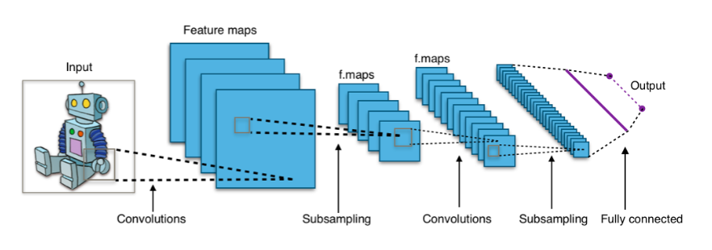
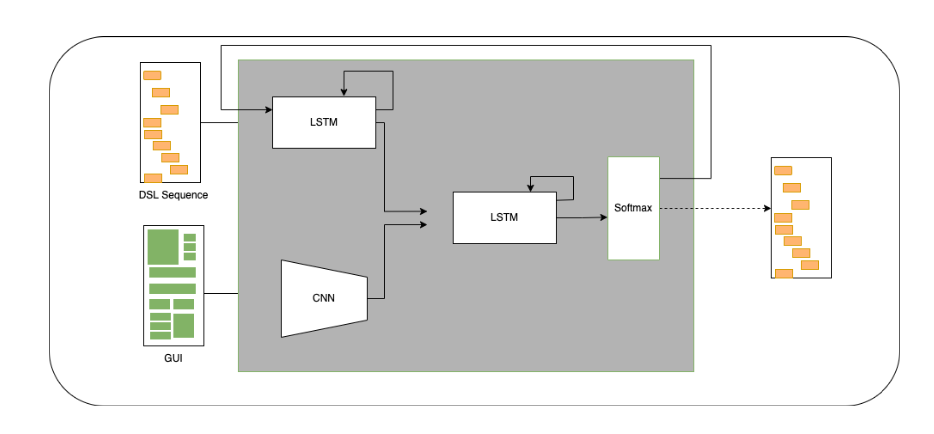

# Code Generator for UI Design
Automation with the help of Artificial Intelligence (AI) is making several jobs easier and several others obsolete. In this Research paper, we discuss and experiment deep learning techniques to assist front-end software developers in converting a screenshot of graphic user interface (GUI) design into HTML code. 

This [Research Paper](https://github.com/prateeshreddy/Code-Generator-for-UI-Design/blob/main/paper.pdf) is written along with Naveeksha Sood and Rahul Shamdasani

-----

## Model Architecture
The model was used to extract features from the GUI screenshot and convert into a feature vector. This follows a hierarchical model which builds a funnel of network, finally resulting in a fully connected layers along with their ability of feature parameter sharing and dimensionality reduction. In our system, these work as an encoder to convert the image into features, which makes this conversion general and not specific to web.

Followed by a language model is trained to establish relationships and hierarchical structure of a web page, it identifies the containers and categorize them as parent and child containers. However, the data in the web page is not of interest, we only model the bootstrap code which is descriptive enough to tell us the geographical position of the containers.

### Combined Parser - LSTM :
We need to map the outputs of the two models and generate a syntactically correct HTML code. First input to this model is the output from the computer vision model which encodes the GUI image into a vector ’E’, where E(i) is the ith feature vector or the ith container. Second input to this model will be the output of language model which is also a vector ’F’ signifying the relationship between tags, such that F(i) is the tag at ith position. Main purpose of this model is to map these two vectors since the proper tags can be retained form first model currently stored in E and the corresponding geographic position are shown in the second vector F which is output from the language model. 

## Conclusion and Future Scope

Auto-code generation not only reduces developers efforts but also reduces down the time to visualize a plan significantly. Various researchers have worked on modelling coding languages for applications like automatic code generation, fixing syntactical errors, detecting plagiarism efficiently, automatic code documentation etc. but only a handful number of studies have explored the area to gen- erate code from visual cues. Our study aimed to tackle this problem using deep learning techniques, and with thorough experimentation defined in the report we hope to set a benchmark in the domain. The task of code generation for GUI screenshot is accomplished by using ``3 models``, one to convert the image to a feature vector using convolutional neural network, second to convert the code to a feature vector using LSTM based neural network and the final model to find the mapping of the output of the previous two models to each other. 

Having learnt the mapping between the image vector and the language vector, our model can now generate bootstrap code for any GUI screenshot it gets as input in the validation phase. The bootstrap code is converted to HTML code using a compilation algorithm. In the validation phase, the generated code and ground truth code are matched using BLEU score. Our approach resulted in ``0.78 BLEU score`` and shows promising qualitative results. We hope to extend our study on various platforms, and test the existing model on hand drawn sketches as well. A rather ambitious goal that we will work towards is generating interlinked web pages using UI/UX code from Adobe XD.
